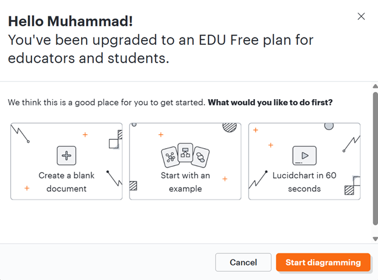
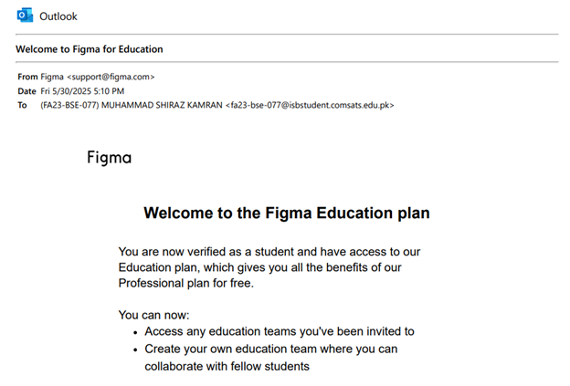

## ✨✨ Unlock a World of Perks with Your .EDU Email! ✨✨

---

Did you know your `.edu` email address can grant you access to a treasure of free or discounted resources? 🎓 From software and cloud services to domain names to hosting services, being a student has a lot of benefits.    
This README is your guide to discovering some of the amazing perks available to you. Explore the possibilities and make the most of your educational credentials!

### What You'll Find Here:

* **Software & Tools:** Free access or discounts on essential software for learning and development.
* **Cloud Services:** Enhanced storage, collaboration platforms, and development environments.
* **Entertainment :** Discounts on streaming services, and more.

Let's dive in and see what amazing freebies await! 👇

---

### Table of Contents
* [Lucidchart](#lucidchart)
* [Figma](#figma)
* [GitHub Student Developer Pack (THE GOAT)](#github-student-developer-pack-the-goat)

---

## Lucidchart

Students and teachers
A free Lucid for Education plan is available to individual teachers and students in K-12 and Higher Education.
To get a free educational account, follow these steps:

1.  Create a free Lucid account with your educational email address.
2.  In the pop-up that appears when you first log in asking how you plan to use Lucid, select Student or Educator

  

### [Access Lucidchart education!](https://lucid.app/users/registerOrLogin/free)

---

## Figma

**Figma for Education**

Free best-in-class tools for the classroom
Figma and FigJam are design and collaboration software used by professional designers, engineers, and makers of all kinds. Use them to ideate, create, and share work—all free, as a student or teacher.

  

### [Access Figma education](https://www.figma.com/education/)

---

## GitHub Student Developer Pack (THE GOAT)
### This pack has the most amount of free services, discounts and learning platforms!

Learn to ship software like a pro. There's no substitute for hands-on experience. But for most students, real world tools can be cost-prohibitive. That's why we created the GitHub Student Developer Pack with some of our partners and friends.

### Applying to GitHub Education

1.  Navigate to your Education benefits settings.
2.  Under "GitHub Education", click Start an application.
3.  Complete the form, then click Submit application.

Once your application is approved, navigate to your GitHub Education portal to use your GitHub Education benefits, such as free access to professional developer tools.

### GitHub Student Pack Benefits

1.  **Free GitHub Pro Account:** You get a free GitHub Pro account for your entire time as a student. This means you can have unlimited private projects, use advanced tools for teamwork, and get access to GitHub Actions to automate your coding workflows.
2.  **Free Domain Name and Hosting:** The pack hooks you up with a free .me domain name from Namecheap and a year of free hosting with GitHub Pages. It's a great way to build your personal website and create a professional online presence to showcase your work.
3.  **Free Cloud Services:** As a student developer, you can power up your projects with free credits and resources for cloud platforms like Digital Ocean, Microsoft Azure, and Heroku. This lets you deploy your apps, store data, and get hands-on experience with cloud technology.
4.  **Learning Resources:** You'll get free access to courses and tutorials from sites like Udacity, DataCamp, and Frontend Masters, covering everything from web development to data science.
5.  **Developer Tools and Services:** You'll get access to powerful code editors from JetBrains, project management tools like Asana, and collaboration platforms like Slack, all designed to make your development process smoother and your teamwork more effective.

#### [Access GitHub student developer pack!](https://education.github.com/pack)

  

---

### Consider giving a STAR this Repository and share it with others!

  

